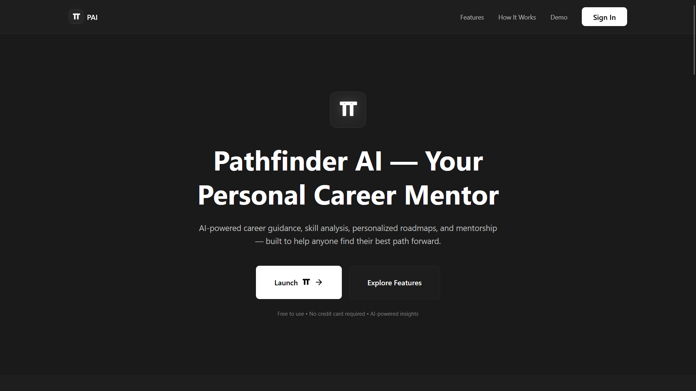
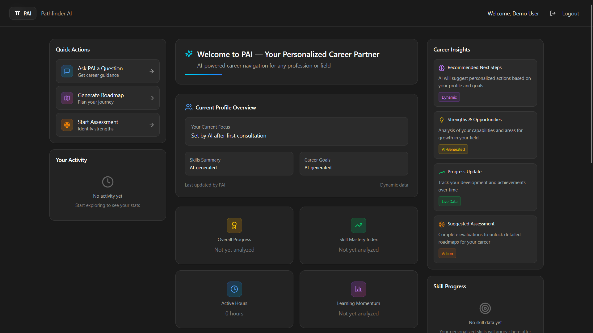
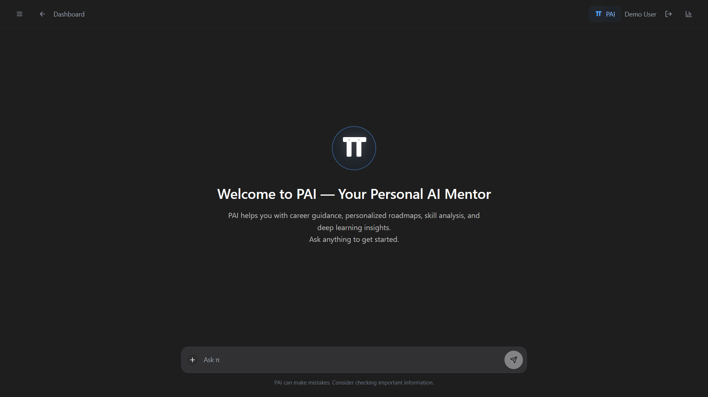
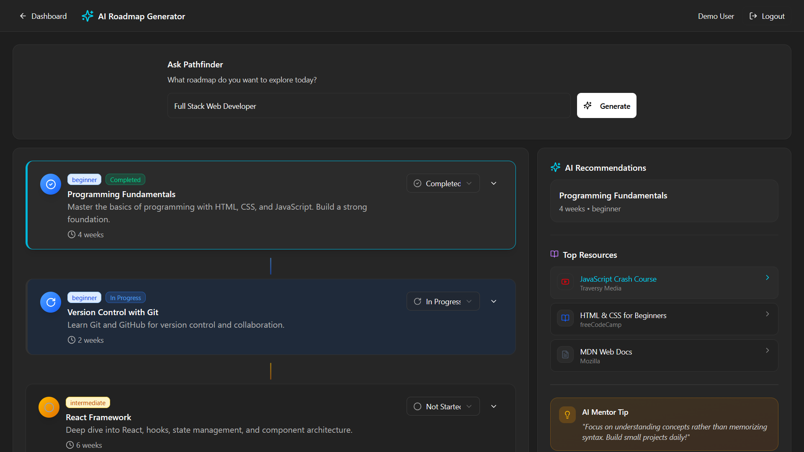
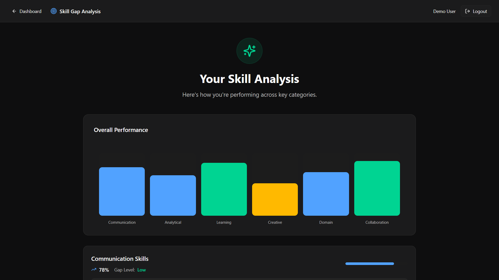

# Pathfinder – AI Career Mentor (Frontend Prototype)

Pathfinder is a **frontend-only UI prototype** for an AI-powered career guidance platform.  
It demonstrates how students can interact with an AI mentor, explore structured career roadmaps, and understand their skill gaps through interactive UI components.

This project focuses on the **user experience, interface design, and logical flow** of an AI career assistant—without any backend, database, or real API integrations.

---

## 📌 Project Overview

This prototype showcases:

- A career-focused AI mentor interface (simulated responses)
- A dynamic roadmap generator visualizing step-by-step learning paths
- A skill gap analysis flow using mock quizzes and results
- Clean, modular UI components built with React + TypeScript
- Professional frontend architecture suitable for production-scale systems

All functionality is powered by **mock data** to preserve privacy and protect proprietary backend logic.

---

# 📸 Screenshots

## Landing Page



## Dashboard View



## AI Mentor (PAI) Interface



## Roadmap Generator



## Skill Gap Analysis



---

## Core Features

### **AI Mentor (Simulated)**

- Chat-style interface with realistic typing animations
- Domain-restricted guidance focused on career-related queries
- Predefined mock responses simulating an AI model

### **Roadmap Generator**

- Tree-structured learning paths rendered using custom UI components
- Each step includes details, progress tracking, and recommended resources
- Fully interactive roadmap viewer

### **Skill Gap Analysis**

- Quiz interface for evaluating student competencies
- Mock scoring logic for demonstration
- Clear visualization of strengths, gaps, and tailored recommendations

### **UI/UX Design**

- Modern, responsive interface
- Clean typography and spacing
- Component-driven architecture built with React and TailwindCSS

---

## Technology Stack

- **Frontend:** React (Vite) + TypeScript
- **Styling:** TailwindCSS
- **Animations:** Framer Motion
- **State Management:** React Hooks
- **Data Handling:** Mock JSON modules (no real APIs)

This project does **not** use:

- Actual AI models
- Supabase or any database
- API keys
- Proprietary backend logic

---

## Project Structure

```css
src/
  components/
  pages/
  ui/
  guidelines/
  styles/
  App.tsx
  main.tsx
  index.css
```

## Getting Started

Clone the repository:

```bash
git clone https://github.com/your-username/pathfinder.git
cd pathfinder
```

## Install dependencies:

```bash
 npm install
```

Run the development server:

```bash
npm run dev
```

Open in browser:

```bash
http://localhost:5173/
```

## Purpose of This Project

- This repository serves as a demonstration of:

- Frontend engineering capabilities

- UI/UX design for AI-driven applications

- Modular and scalable code organization

- Design thinking for educational and career-guidance tools

- Ability to build interactive experiences without backend systems

- It is intended for learning, portfolio presentation, and academic use.

## Limitations

- No real AI model is connected

- All responses and roadmaps are simulated

- No authentication or database functionality

- Not intended for production deployment

## License

- This project is provided for educational and demonstration purposes.
  You may reference or learn from the structure, but it may not be rebranded as a commercial solution.

---
